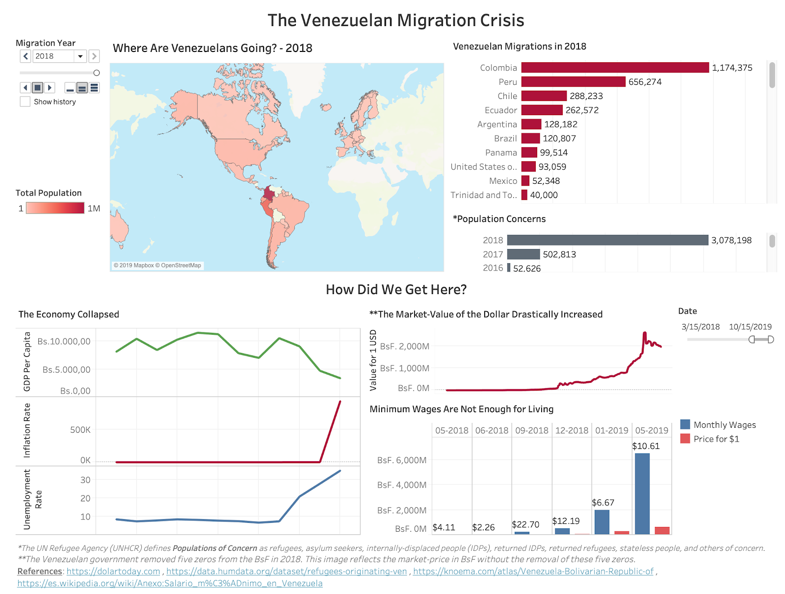

# Data Visualizaton Assignment 1
## Time Series Visualization with Tableau
***By Ana Parra Vera***
*October 2019*

### DASHBOARD DETAILS
- The published dashboard can be found [here]().
- The interactive view of the world map can be found on an MP4 file [here](assets/dashboard-animation.mp4). ***Note that Tableau Public does not include the animation shown on this video***.

### GOALS
I hope that by looking at this dashboards, consumers understand the severity of the economic situation in Venezuela. The story told is that people have migrated in desperate ways during the last few years because life in Venezuela is simply unbearable. People would rather literally walk to a nearby country rather than continue to die from starvation. This dashboard aims to answer the question of *why has the migration crisis been happening in Venezuela?*

### CHOICES & CONSIDERATIONS
One difficult choice to make was selecting what data would tell this story the most accurately and portray the severity of this issue to an audience who has not lived this misery, or even heard of it.
Because there are other reasons why people are migrating (other than only the economic situation) it was difficult to answer what happened in only a couple of charts. The focus on this dashboard is the severe economic situation but it does not cover other important factors such as the overall insecurity and lack of resources.
The most interesting charts are the ones showing how the market-rate for 1USD skyrocketed in the last few years and how what an average American earns in an hour is what a Venezuelan person earns in a month. In reality, this should be the value per year but it is very difficult to find this information with accuracy. Given more time, I would have done more research to show how the US minimum wage per hour is actually more than what most Venezuelans earn in a year. Luckily, the hyperinflation graph does allude to that idea.
The choice of a world map showing where in-crisis Venezuelans have migrated to in the last couple of years is very interesting because it shows over the years how there were very few people migrating to lots of different countries and now hundreds of Venezuelans migrate on a daily basis to nearby countries. The animation of the map shows this transition. However, this dataset also does not show the “true” image because a lot of these migration cases are not recorded anywhere. You can read more about it on the [UNHRC Americas Instagram page](https://instagram.com/acnur_unhcr_americas?igshid=y1phxdmvmntk), and on posts such as [this one](https://www.instagram.com/p/B3ab88oJn_P/?igshid=1xoi6ra5nyo4q).
Another important choice was using a variety of data sources and to include as much information as possible to show why the migration crisis has been occurring. These are referenced at the end of the dashboard to show that this is not simply a sad story but a devastating reality.

### EXPERIENCE USING TABLEAU
One challenge that I have faced many times is trying to show two timelines on the same graph. I have tried using a dual axis but if the scales are different then this does not really show a truthful view of the data. Another big challenge was playing with datasets from two different data sources, linking them by editing the data relationship on Tableau and plotting them on the same area. I had done this before but playing with attributes vs. measures was challenging because I wanted a time series of the minimum wages in both BsF and USD prices. I had to create a new variable because my dataset only had monthly minimum wages in BsF. I used the conversion rates from my market-rate dataset in order to find the minimum wages in USD. The challenging part was figuring out how to make these two values be two different bars along the same timeline. Eventually, the result was exactly what I wanted to visualize.

